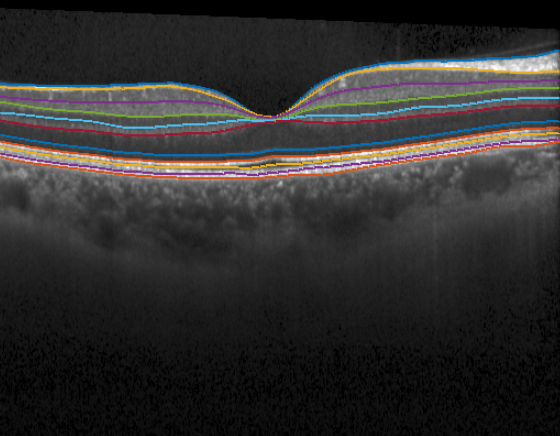
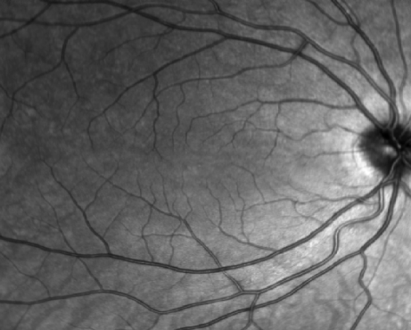
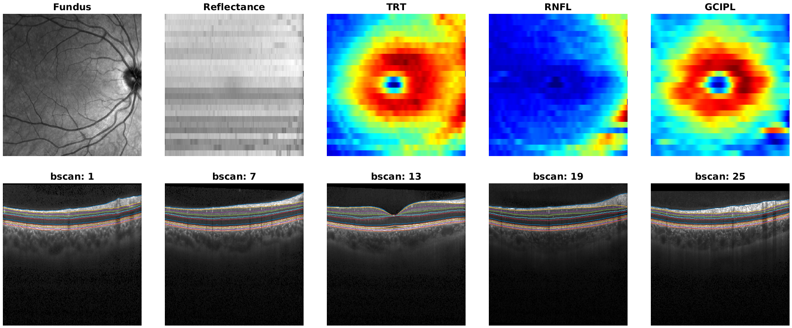

Tutorials
=========

.. _tuto:

This page contains two tutorials:

1. :ref:`Read and explore OCT data <tutorial_read_oct>`:
2. :ref:`Feature extraction <tutorial_feature_extraction>`

.. _tutorial_read_oct:

**Read and explore OCT data**
-----------------------------
This tutorial shows how to:

* Load OCT files into MATLAB
* Visualize loaded data (fundus image, OCT slices, segmentation...)
* Generate a visual report

The source code of this tutorial can be found in the ``tutorials`` folder or `here <https://github.com/drombas/retimat/blob/main/tutorials/File_Reading_Visualization.mlx>`_.

0. Understand your data
^^^^^^^^^^^^^^^^^^^^^^^
The first step is to understand your images in terms of:

* *Device and file format*: there are many different devices and file formats and not all of them are equally easy to read and have the same information.
* *Acquisition protocol*: OCT images are composed of one or more 2D images (aka slices or B-scans). It is crucial to know the area covered by these B-scans (macula, optic disk, wide), as well as their geometrical arrangement (horizontal, circular).

Understanding the above will help troubleshoots problems.

RETIMAT can only read ``vol``, ``e2e``, ``fda``, ``img`` files. If your files are different, you can try the following Python packages:

* `OCT-Converter <hhttps://github.com/marksgraham/OCT-Converter>`_ 
* `eyepy <https://github.com/MedVisBonn/eyepy>`_ 

1. Load the images
^^^^^^^^^^^^^^^^^^
Images are loaded into MATLAB by means of dedicated read functions.

For instance, a Heidelberg ``vol`` file can be read as:

.. code-block::

        [header, seg, bscan, fundus] = read_vol(file)

This function returns four arguments:

* ``header``: struct with metadata (image sdimensions, lateraliry, ...)
* ``seg``: struct with retinal layer segmentation
* ``bscan``: a 3D image with B-scans
* ``fundus``: a 2D image with a fundus image

Other file formats can be read similarly:

.. code-block:: matlab

        [header, seg, bscan, fundus] = read_e2e(file)

A single ``E2E`` file can contain more than one OCT volumes (usually two: one per eye).
For this reason, the returned objects are cell lists each related to a single OCT volume.

Topcon ``fda`` files contain metadata, OCT, segmentation and a color fundus image. To read them:

.. code-block:: matlab

        [header, seg, bscan, fundus] = read_fda(file)

Cirrus ``img`` files only contain 1 OCT volume and no segmentation or metadata.
The ``read_img`` function reads the B-scans and tries to infer the metadata from image size and file name.

.. code-block:: matlab

        [header, bscan] = read_img(file)

The fundus image acquired along with the img is stored in a separated ``bin`` file that can be read by:

.. code-block:: matlab

        fundus = read_bin(file)

2. Explore metadata
^^^^^^^^^^^^^^^^^^^
After reading a file, it is a good idea to look into the metadata stored in the header to check that everything looks good.

We can do that with the following command:

.. code-block:: matlab

        disp(header)

Header structure is an attempt at harmonizing data from different scanners. 

Fields should be equivalent across scanners. However, due to the difficulty of fully reading propietary file formats, not all the fields will be present for every format.

We can also check which segmented layer boundaries are present in the file:

.. code-block:: matlab

        boundaries = fields(seg);
        disp(boundaries')

3. Visualize the images
^^^^^^^^^^^^^^^^^^^^^^^
Quality assurance is a key step in any image analysis pipeline. In OCT, poor contrast, artifacts, and segmentation errors are not uncommon.
Therefore, it is crucial to inspect the data to detect those problems.

Here we plot the middle B-scan with its segmentation:

.. code-block:: matlab

        f = figure;
        idx_bscan = 13;
        imshow(bscan(:,:,idx_bscan)); hold on;
        for j=1:length(boundaries)
            plot(seg.(boundaries{j})(idx_bscan, :))
        end

Often a fundus image is acquired alongside the OCT volume. Depending on the scanner this image is different:

* Heidelberg: a graysacle image stored in ``vol``, ``e2e`` files.
* Cirrus: a grayscale image stored in a separated ``bin`` file
* Topcon: an RGB color image stored inside ``fda`` files.

To visualize the fundus image we can just:

.. code-block:: matlab
        
        f = figure;
        imagesc(fundus); colormap(gray); axis("off");

4. Generate a report
^^^^^^^^^^^^^^^^^^^^
Doing all the previous steps separately is not always convenient.

To simplify data inspection, we can automatically create a summary report using the ``generate_report()`` function.
The function allows us to pass fundus,bscan and segmentation data and builds a tiled plot that can be stored in memory.

A full report includes:

* *Fundus image*  
* *Reflectance map*: a 2D map obtained by averaging A-scan intensities in depth. Useful to detect noisy B-scans and shades.
* *Thickness maps*: 2D maps generated by computing layer thicknesses from segmentation data. Useful to detect segmentation errors or lessions.
* *B-scans*: several slices with overlapping segmentation.

As an example, let's generate a full report for the loaded image.

As arguments we need to provide image data and the layers for which we want to plot thickness maps

.. code-block:: matlab

        layers = {'TRT','RNFL','GCIPL'};
        generate_report(bscan, seg, fundus, layers);

Finally, to store it as a ``png`` withoug opening a window:

.. code-block:: matlab

        generate_report(bscan, seg, fundus, layers, 'file_name', 'report.png', 'visible', 'off');

**Feature extraction**
----------------------

.. _tutorial_feature_extraction:

This tutorial shows how to build a feature extraction pipeline step by step

0. Preliminaries
^^^^^^^^^^^^^^^^

The computation of retinal features requires the segmentation or retinal layer boundaries.

Here, there are two possiblities:

* The images were already segmented and the segmentation is stored in vol, e2e, or fda files
* We have raw images without segmentation

We can check that by reading the images and trying to visualize the segmentation as in the previous tutorial.

In the segmentation is not available, we recommend using `OCT Explorer <https://iibi.uiowa.edu/oct-reference>`_ software to do so. OCT Explorer allows you to load your images and save the segmentation as an ``xml`` file that can be read by RETIMAT.

After segmentation, we need to decide which features we want to compute. There are four categories of features:

* *Thickness*: average thickness values over predefined macular sectors.
* *Foveal pit morphology*: geometrical features of the foveal pit morphology (slope, radius, ...).
* *Reflectance*: features related with image intensity.
* *Texture analysis*: features that measure statistical properties of the thickness surface.

Each feature type requires a different set of processing steps. In the next steps basic thickness feature extraction is described. The source code of is `available <https://github.com/drombas/retimat/blob/main/tutorials/Thickness_Analysis.mlx>`_. If you want to extract non-thickness features please check the other `tutorials <https://github.com/drombas/retimat/blob/main/tutorials>`_.

1. Load the files
^^^^^^^^^^^^^^^^^
This step parses the information inside the file and computes the ``X``, ``Y`` coordinates of each A-scan.

To analyse retinal thickness we only need the header and the segmentation data.

.. code-block:: matlab

        [header, seg, ~, ~] = read_vol(file, 'get_coordinates');

        X = header.X_oct;
        Y = header.Y_oct;

2. Preprocessing
^^^^^^^^^^^^^^^^
We can now compute thicknesses as the difference between segmented boundaries.

We need to specify the layers to analyse as input.

Thickness values are by defaul in pixels, but can be computed in micrometers if we pass the axial resolution (``scale_z``) to the function.
The output are stored in the struct Thickness with a field for every layer.

.. code-block:: matlab

        layers = {'TRT', 'GCIPL'};
        Thickness = compute_thickness(seg, layers, header.scale_z);

        TRT = Thickness.TRT;
        GCIPL = Thickness.GCIPL;

To compute averaged sector thicknesses it is convenient to have regular spatial sampling (i.e., same sampling distribution across the macula).
To achieve that we can transform our original A-Scan coordinates to a regular grid by using interpolation.

.. code-block:: matlab

        [X_new, Y_new, TRT_new] = resample_map(X, Y, TRT, 'regular', 'max_d', 3, 'n_point', 100);
        [X_new, Y_new, GCIPL_new] = resample_map(X, Y, GCIPL, 'regular', 'max_d', 3, 'n_point', 100);

3. Foveal location
^^^^^^^^^^^^^^^^^^
Often, acquired images may not be correctly centered at the foveal pit (due to fixation errors).
This can result in erroneous measurement and must be corrected. To do this we need to:

1. Locate the actual foveal center automatically
2. Set ``X``, ``Y`` coordinate origin to the foveal center

.. code-block:: matlab

        [x_fovea, y_fovea] = find_fovea(X, Y, TRT);

        X = X - x_fovea;
        Y = Y - y_fovea;

4. Sectorize thickness
^^^^^^^^^^^^^^^^^^^^^^
Often we are interested in average measures of the thickness maps of above.

For instance, to compute ETDRS sectorized we just need to:

.. code-block:: matlab

        [TRT_etdrs, Sect_etdrs]  = sectorize_map(X_new, Y_new, TRT_new, 'mean', 'etdrs');
        [GCIPL_etdrs, Sect_etdrs] = sectorize_map(X_new, Y_new, GCIPL_new, 'mean', 'etdrs');

This returns the averaged numeric values: ``TRT_etdrs`` and a ``Sect_etdrs`` struct.
ETDRS sectors are: central, inner nasal, inner superior, inner  temporal, inner inferior, outer nasal, outer superior, outer temporal and outer inferior

.. code-block:: matlab

        etdrs_vars = {'C', 'IN', 'IS', 'IT', 'II', 'ON', 'OS', 'OT', 'OI'};
        T = cell2table([layers' num2cell([TRT_etdrs; GCIPL_etdrs])], 'VariableNames',[{'layer'}, etdrs_vars])

We can also use more advanced sectorizations

.. code-block:: matlab

        Sectors.type    = 'wedge';
        Sectors.radius  = linspace(0, 3, 10);
        Sectors.theta_0 = 0;
        Sectors.n_angle = 20;
        Sectors.n_sect  = Sectors.n_angle * (length(Sectors.radius) - 1);

        [TRT_wedge, Sect_wedge]  = sectorize_map(X_new, Y_new, TRT_new, 'mean', Sectors);
        [GCIPL_etdrs, Sect_wedge] = sectorize_map(X_new, Y_new, GCIPL_new, 'mean', Sectors);

5. Visualize resutls
^^^^^^^^^^^^^^^^^^^^
We can visualize arbitrary segmentations by using plot_sectors()

.. code-block:: matlab

        f = figure('Position', [0 0 1200 400]);

        subplot(131);
        surf(X_new, Y_new, TRT_new, 'EdgeColor', 'none'); view(0,90);
        axis equal;
        title('Thickness map')

        subplot(132);
        plot_sectors(TRT_etdrs, Sect_etdrs); title('ETDRS');

        subplot(133);
        plot_sectors(TRT_wedge, Sect_wedge); title('Wedge');

        colormap("jet")

.. image:: images/thickness.png
    :align: center

